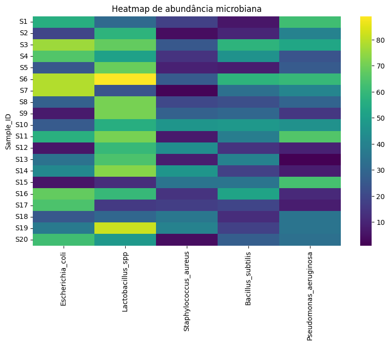
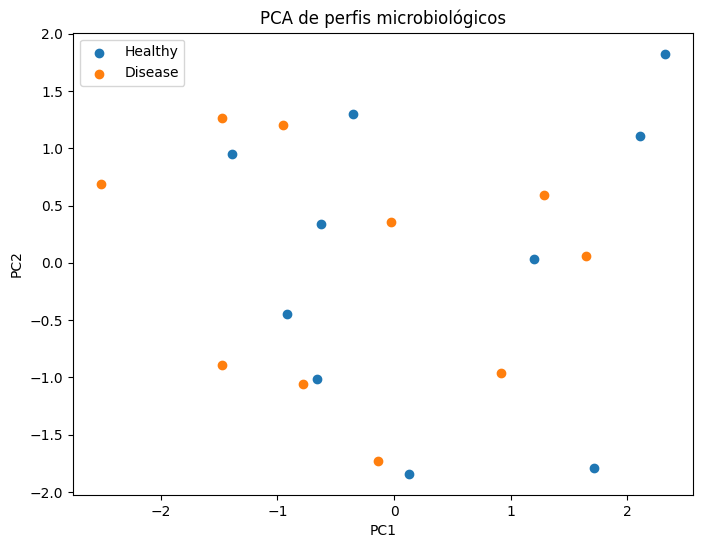
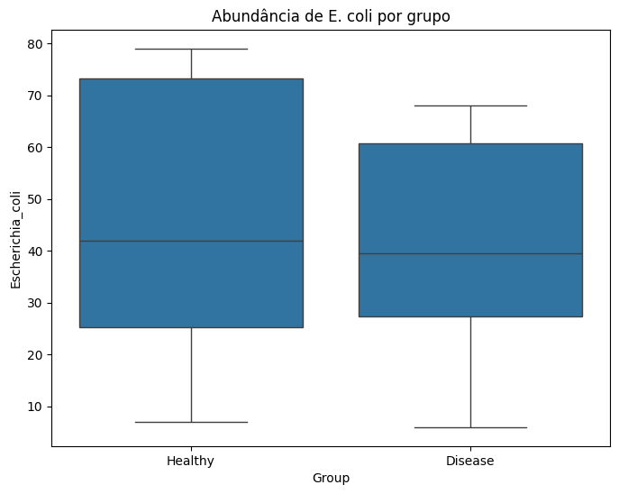

# Microbiome Data Analysis

Projeto de bioinformática voltado à análise exploratória de dados microbiológicos simulando abundância bacteriana obtida por sequenciamento.

## Objetivo

Explorar padrões microbiológicos entre grupos Healthy e Disease utilizando Python para análise de dados, visualização biológica e redução de dimensionalidade.

## Tecnologias utilizadas

- Python
- Pandas
- NumPy
- Matplotlib
- Seaborn
- Scikit-learn
- Jupyter Notebook

## Estrutura do projeto

- `data/` → dataset microbiológico
- `notebooks/` → análises em Jupyter Notebook
- `images/` → visualizações microbiológicas

## Análises realizadas

- Estatística descritiva
- Comparação entre grupos Healthy vs Disease
- Análise de abundância bacteriana
- Heatmap microbiológico
- PCA microbiológico
- Boxplot de distribuição bacteriana

## Visualizações

### Heatmap microbiológico

### PCA microbiológico

### Boxplot de abundância bacteriana

## Interpretação biológica

Os resultados sugerem diferenças nos perfis microbiológicos entre os grupos Healthy e Disease. O PCA demonstra separação parcial entre amostras, enquanto o heatmap evidencia variações de abundância bacteriana entre indivíduos.

## Possíveis aplicações

- Microbioma
- Metagenômica
- Sequenciamento bacteriano
- Bioinformática microbiológica
- Análise exploratória de dados biológicos
